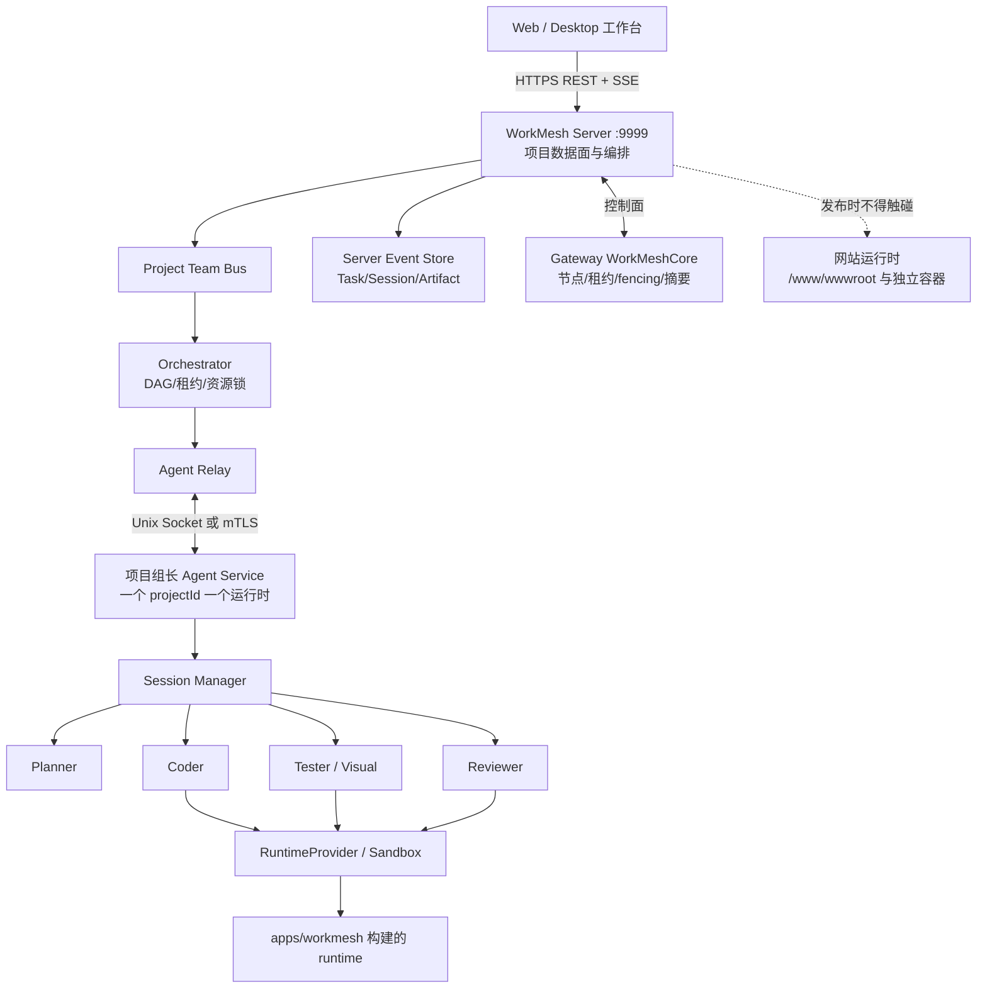
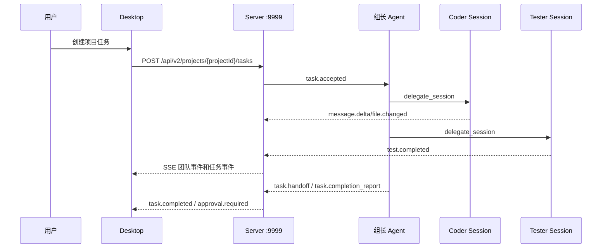

<!-- SPDX-License-Identifier: GPL-3.0-only -->
<!-- Copyright (c) 2026 WorkMesh contributors -->

# 项目级多 Agent 执行架构

> 本文描述目标架构和实施边界。任务控制面、Agent Service Relay、Session SSE 联调和基础并发护栏已实现；Sandbox、宿主机硬资源隔离、密钥生命周期和生产升级仍按开发状态台账推进，不能把目标接口视为全部已实现。

## 总体拓扑

## 运行模型

- `apps/workmesh` 是 Agent 源码唯一来源；`dist/workmesh` 是固定提交构建、签名并验哈希后的 runtime。
- 一个 `projectId + ProjectAgentBinding` 只有一个 active Agent Service；同项目并发使用 Session，不重复启动主 Agent。
- 组长 Session 接收用户任务，按白名单创建 planner、coder、tester、reviewer 等 Session；Session 通过 `task.handoff` 交接，并用 `task.completion_report` 回报验证结果。
- Session 不是独立团队成员，不单独注册心跳；Server 根据 Agent Service 的租约和心跳维护成员在线状态。
- 同一 Agent Profile 可以绑定多个项目，但每个项目隔离源码、规则、记忆、凭据、Session 数据库、缓存、Artifact 和资源预算。
- Gateway 只保存节点、证书、租约、审批、hash 和有界审计摘要；任务正文、轨迹、完整日志和 Artifact 元数据/正文由 WorkMesh Server 持有。

## 通信和反馈

| 链路 | 方式 | 说明 |
| --- | --- | --- |
| Desktop → Server | 同源 HTTPS `/api/v2` | 创建、取消、审批、追加输入和直接完成 |
| Server → Desktop | SSE | 模型 delta、工具事件、测试、团队动态和任务状态 |
| Agent → Server | Unix Socket 或 mTLS 长连接 | 一个 Agent Service 一条连接，多 Session/Task 复用 |
| Server → Agent | Agent Relay | `prepare/start/prompt/input/interrupt/collect/cancel/destroy/health` |
| Artifact | Agent 受控分块上传、Server 校验后 HTTP Range 下载 | 大日志、截图、视频、trace 不放入事件正文；只使用 `WORKMESH_DATA_DIR/workmesh-artifacts` |
| Server ↔ Gateway | 节点控制协议 | 注册、心跳、租约、fencing 和能力摘要 |

Server 先持久化事件，再推送客户端。Desktop 使用 `Last-Event-ID` 或 cursor 断点补取；Agent 使用上行 sequence 和 `acceptedThrough` 确认重放。高频模型 delta 按 20–100ms 合并，不转发隐藏推理、系统提示词和凭据。

## 项目任务流程

## 并行开发边界

- 不同项目可以并行。
- 同项目只读任务可以并行。
- 同项目写任务默认串行；并行写任务必须使用独立 worktree。
- 文件、API、数据库表、权限和模型配置使用资源锁；重叠范围阻塞或生成冲突报告。
- 同一工作区只能由一个验证负责人运行重型编译、全量测试或发布验收。
- 共享热更新服务由人工启动，Agent 只检查和复用，不自动停止。

## 进程生命周期门禁

所有 Agent 自己启动的构建、测试、Smoke Test 和 runtime 必须登记 `.tmp/dev-shared/processes/`，记录 task、owner、cwd、PID、端口和进程组，并每 5 秒心跳。正常退出、失败、取消和超时都必须：

1. 停止进程组和已登记子树；
2. 等待进程退出；
3. 超时后按策略升级到 `SIGKILL`；
4. 检查 `/proc/<pid>/stat`，区分 zombie 和仍运行进程；
5. 检查监听端口、子孙进程和临时目录；
6. 只有全部确认后才删除会话记录。

人工共享服务不得被自动杀死；归属不明、zombie 父进程、端口未释放或清理失败必须进入 `blocked/awaiting_human`。当前 `scripts/process-session.mjs` 已增加登记、心跳、starttime/PGID 归属校验、进程树等待、SIGTERM→SIGKILL、zombie/端口/临时目录复核和失败留痕；cgroup/Windows Job Object 与系统级 CPU/RSS/PID 硬上限仍属于 P4/P5，不能据此宣称宿主机全局无僵尸。

## 资源和安全

每个任务声明 `resourceProfile`、CPU、内存、PID、FD、磁盘、网络、超时和日志上限。默认 profile 为 `small=1 CPU/1 GiB/256 PIDs`、`medium=2 CPU/2 GiB/512 PIDs`、`large=4 CPU/4 GiB/1024 PIDs`。Server 和 Relay 都按 `small=1`、`medium=2`、`large=4` 资源单位做项目内准入；Server 超过 `WORKMESH_AGENT_MAX_RESOURCE_UNITS` 的任务进入 `waiting_resource`，预算释放后自动入队，Relay 超限任务上报 `task.blocked/resource_limit`。Linux `CgroupV2Controller` 已提供 CPU、内存和 PID 控制文件及回收适配，但尚未由外部 Sandbox CLI 接线；磁盘容量必须由文件系统 quota 或 MicroVM 磁盘配额提供，不能由 cgroup v2 冒充。Agent 总 CPU 不超过主机可用 CPU 70%，总内存不超过 60%，至少保留 30% 给系统、Server 和网站。

Sandbox 只挂载当前任务 worktree，禁止 Docker Socket、网站数据卷、SSH 私钥、其他项目目录、宿主敏感目录和未登记网络。生产部署、破坏性迁移、systemd/Docker/Nginx/DNS/证书/权限/沙箱/网络/凭据变更必须人工审批。

## 9999 在线升级

- 新版本进入独立 `releases/<releaseId>`，候选阶段只读预检。
- `9999` 由 systemd socket activation 或管理 upstream 持有；不能让新旧 Server 同时写同一 SQLite。
- 旧版本 drain 后切换 `9999`，Agent Relay 重连并补发事件；旧版本保留回滚。
- 发布脚本只能操作 `/opt/workmesh-server` 受控目录，禁止触碰 `/www/wwwroot`、网站进程、网站容器、网站数据库和网站 Nginx 配置。
- Website 运行面与 Server 控制面分离，Server 发布不得重启正在运行的网站。
